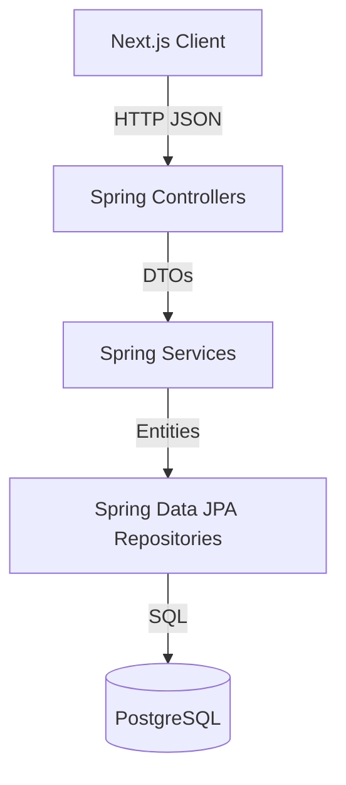

# TeamVault Project Architecture

This document serves as a high-level system design overview of TeamVault. It documents the problem statement, core architectural decisions, and data flow. This is designed to be an excellent refresher for future interview preparation.

---

## 1. Problem Statement & Motivation

**The Problem:** During software engineering internships, onboarding is often chaotic. Knowledge is scattered across Slack threads, Google Docs, embedded code comments, and individual developer memory. When people leave a project, valuable context disappears.

**The Solution:** TeamVault is a lightweight, focused knowledge-sharing hub for small teams. It centralizes project documentation into a single secure platform. It eschews the bloat of massive enterprise wikis in favor of a clean, markdown-driven, developer-friendly interface.

---

## 2. Core Features
- **Stateless Authentication:** Secure JWT-based login and registration.
- **Project Workspaces:** Isolated project environments for documentation.
- **Markdown Articles:** Live-preview markdown editor for writing technical docs.
- **Role-Based Access Control (RBAC):** Granular permissions (`OWNER`, `EDITOR`, `VIEWER`) to securely share projects via email invitations.
- **Unified Omnibar:** Global and project-scoped search functionality (`⌘K`).

---

## 3. Technology Stack & System Design

I chose a stack that balances rapid development with enterprise-grade scalability and strict typing.

- **Frontend:** Next.js 14 (React), Tailwind CSS, Axios.
- **Backend:** Java 21, Spring Boot 3, Spring Security, Spring Data JPA.
- **Database:** PostgreSQL (Hosted on Supabase).
- **Deployment:** Docker, GitHub Actions (CI/CD), Render, Vercel.

### Why Spring Boot instead of Express.js?
While Express.js allows for rapid prototyping, it lacks rigid structure. As projects scale, Express codebases often degenerate into unstructured "spaghetti code." Spring Boot enforces a strict, layered architecture (Controllers, Services, Repositories), ensuring high maintainability, strong typing, and enterprise-standard design patterns.

---

## 4. High-Level Architecture & Request Flow

The system follows a standard 3-tier architecture.



1. **Client Layer:** The user interacts with the React UI. Axios sends a REST HTTP request.
2. **Controller Layer:** Receives the HTTP request, validates the incoming JSON against a Data Transfer Object (DTO), and passes the DTO to the Service layer.
3. **Service Layer:** Executes the core business logic (e.g., verifying passwords, checking RBAC permissions).
4. **Repository Layer:** Translates Java method calls into SQL queries via Hibernate/JPA to interact with the database.

---

## 5. Security Architecture

### Authentication (AuthN)
TeamVault uses a **Stateless JWT approach**.
1. User logs in. Server validates credentials against the DB.
2. Server generates a signed JWT and returns it.
3. The React client stores the JWT and sends it in the `Authorization: Bearer <token>` header for all subsequent requests.
4. A custom `JwtAuthenticationFilter` intercepts requests, validates the signature, and authenticates the user context for that specific request.
> *See [SPRING_SECURITY.md](https://github.com/nitin-is-me/TeamVault/tree/master/docs/SPRING_SECURITY.md) for deeper internals.*

### Authorization (AuthZ)
TeamVault implements **Role-Based Access Control (RBAC)**.
1. The `ProjectMember` join table stores the intersection of a `User`, a `Project`, and a `ProjectRole` (`OWNER`, `EDITOR`, `VIEWER`).
2. Before modifying an article, the `ArticleService` queries the user's role for that specific project.
3. If the role does not grant adequate permissions, a `403 Forbidden` is thrown.
> *See [RBAC_EXPLAINED.md](https://github.com/nitin-is-me/TeamVault/tree/master/docs/RBAC_EXPLAINED.md) for deeper internals.*

---

## 6. Database Schema Overview

The relational database is normalized and relies heavily on Foreign Keys.

- **`users`**: Stores authentication details (email, bcrypt password hash).
- **`projects`**: Stores the high-level project workspaces.
- **`articles`**: Stores the markdown documentation. Belongs to a single Project.
- **`project_members`**: The crucial mapping table enabling RBAC. Links Users to Projects with a specific Role.

---

## 7. Folder Structure (Backend)

The Spring Boot backend is strictly organized by domain and technical responsibility:

```text
server/src/main/java/com/nitin/teamvault/
 ├── config/       # Global configuration (Security, CORS, JWT filters)
 ├── controller/   # REST API endpoints (Entry points)
 ├── dto/          # Data Transfer Objects (Request/Response shapes)
 ├── entity/       # Database models (JPA mapped classes)
 ├── exception/    # Global error handlers
 ├── repository/   # Database interfaces (Spring Data JPA)
 └── service/      # Core business logic
```
